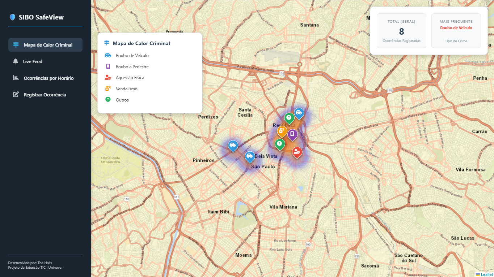

# 🛡️ SafeView | Dashboard de Segurança Inteligente

  

Este é o protótipo do **SafeView**, um sistema web focado em mapeamento criminal via crowdsourcing de dados. Projeto desenvolvido para a disciplina de Projeto de Extensão TIC da Uninove pela equipe **The Halls**.

---

## 🛑 Pré-requisitos (Obrigatório)

Antes de começar, você precisa ter instalado no seu PC:
1. **Python:** [Baixar aqui](https://www.python.org/downloads/) (⚠️ Marque a opção **"Add Python to PATH"** na tela de instalação).
2. **Git:** [Baixar aqui](https://git-scm.com/download/win).

---

## 🛠️ PASSO A PASSO: Primeira vez rodando o projeto

Se você acabou de pegar o projeto, abra o **VS Code**, clique em `Terminal > Novo Terminal` e rode os comandos abaixo, um por um, apertando Enter após cada linha:

**1. Baixe o código do GitHub:**
`git clone https://github.com/andersonsouzx/safeview-prototipo.git`

**2. Entre na pasta do projeto:**
`cd safeview-prototipo`

**3. Crie o Ambiente Virtual (A "bolha" do Python):**
`python -m venv venv`

**4. Ative o Ambiente Virtual:**
`.\venv\Scripts\activate`
*(Se der erro vermelho no Windows, rode `Set-ExecutionPolicy Unrestricted -Scope CurrentUser`, confirme com `S` e tente ativar de novo).*

**5. Instale as dependências (O Flask):**
`pip install -r requirements.txt`

**6. Ligue o servidor!**
`python app.py`

👉 Após rodar o último comando, acesse no seu navegador: **http://127.0.0.1:5000**

---

## 🚀 DIA A DIA: Como ligar o sistema nas próximas vezes

Você não precisa baixar nem instalar tudo de novo. Quando for trabalhar no projeto nos próximos dias, abra a pasta `safeview-prototipo` no VS Code, abra o Terminal e rode **apenas estes dois comandos**:

**1. Ative o Ambiente Virtual:**
`.\venv\Scripts\activate`

**2. Ligue o servidor:**
`python app.py`

---

**💡 Dica de Teste para a Equipe:** O banco de dados (`sibo.db`) é criado automaticamente. Para zerar o mapa e o feed, basta deletar o arquivo `sibo.db` no VS Code e rodar o `python app.py` de novo. O sistema injetará ocorrências fictícias automaticamente para demonstração.
